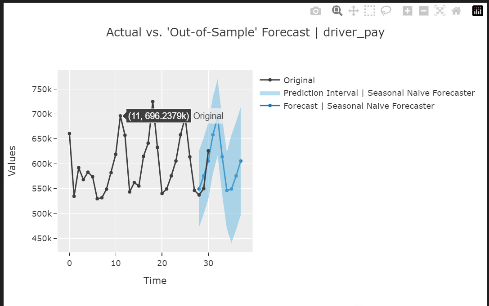
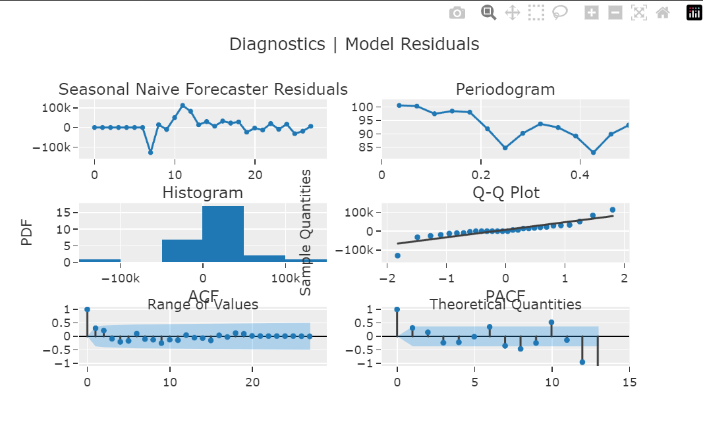
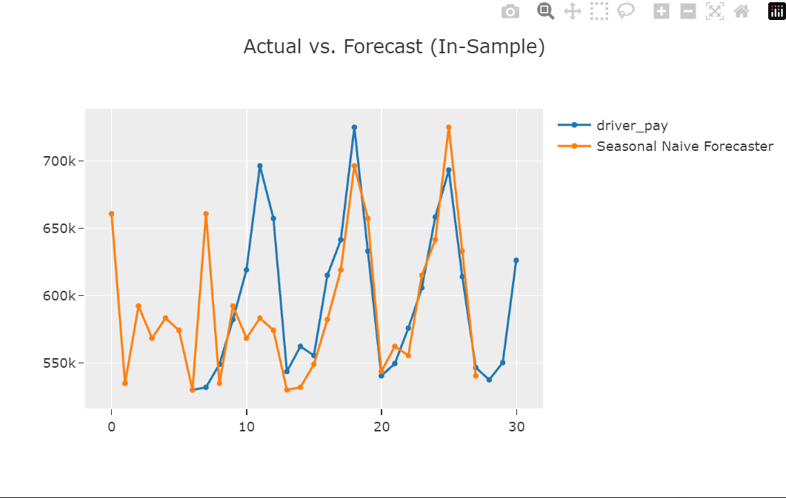

# Time Series con PyCaret [notebook](ML_pago_conductor.ipynb)

Este script utiliza PyCaret para desarrollar un modelo de series temporales con el objetivo de predecir 'driver_pay' en los viajes de taxis de enero de 2023, empleando datos cargados desde un archivo Parquet. Los pasos incluyen la carga y preprocesamiento de datos, la agrupación por fecha y la configuración del modelo con PyCaret. Se realiza una comparación de modelos, seguida de visualizaciones y la finalización del mejor modelo para futuras predicciones. Se evalúan métricas de rendimiento específicas de series temporales, y las visualizaciones proporcionan información sobre pronósticos y diagnósticos. Este documento brinda una visión general concisa del proceso, recomendando ajustes según las necesidades específicas del problema. 🚀

## Gráficas generadas con el modelo Time Series

#### Gráfico de pronóstico

 
 
 
 
 

#### Gráfico de diagnóstico

 
 
 
 
 

#### Gráfico de resultados en la muestra

[Documentación del modelo](docs_ml.md)
