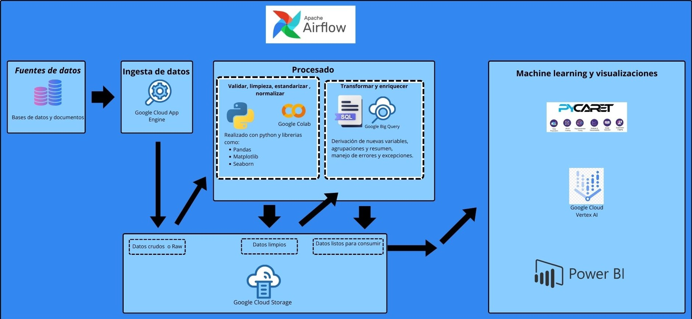

# **Pipeline**
 

# Implementación Stack Tecnológico

En este proyecto, utilizaremos diversas herramientas y tecnologías para llevar a cabo el análisis de datos y el desarrollo de modelos de Machine Learning. Consideraremos la implementación de un sistema de gestión de bases de datos para almacenar de manera eficiente los datos recopilados.

## Lenguaje de Programación
Utilizaremos **Python** como lenguaje principal para realizar tareas de Extract, Transform, y Load (ETL), limpieza de datos, y desarrollo de modelos de Machine Learning. Algunas de las bibliotecas clave incluyen:
- Pandas
- Matplotlib
- Seaborn
- Scikit-Learn </n>

[**Ejemplo**](ejemplo.md)

## Bases de Datos
- Base de datos en **DB Browser SQLite**
Para consultas y manejo de bases de datos relacionales, emplearemos el lenguaje **SQL**. 

## Almacenamiento de Datos
- Estos datos se almacenarán en 2 data lakes. 
1) El *raw* que es donde se almacenan los datos descargados por medio de _web scrapping_, llamadas a API´s e información recabada manualmente por la web.

## Desarrollo, despliegue de modelos y análisis de los datos
- [**Pycaret:**](PYCARET.md) Biblioteca de Python diseñada para simplificar el proceso de análisis de datos y modelado de Machine Learning.

## Orquestación de Trabajos
La orquestación del trabajo se hace automatizando y creando tareas por medio de un script realizado en el lenguaje de programación *Python*

# Automatización del stack tecnológico (pipeline automatizado)
Para una visualización más agradable, se puede ver en el siguiente archivo. [link](Stack Tecnológico\pipeline_automatizado.md)
